# Agentic OS — design (Phase 1: Claude Code Observability Hub)

**Status:** approved by Marco, ready for implementation planning
**Repo:** `MK023/agentic-os` (nuovo, separato da `langfuse-devops-lab`)
**Data:** 2026-07-28

## 1. Cos'è

Agentic OS è la piattaforma personale di Marco per osservare e, nel tempo, orchestrare
il proprio lavoro assistito da AI attraverso tutti i suoi progetti — a partire da
Claude Code, con l'obiettivo dichiarato di diventare un pannello di controllo
centralizzato a cui si agganciano nuovi producer (altri repo, altri agenti) via un
contratto di ingestione generico.

Questo documento specifica **solo la Fase 1** in dettaglio implementativo. Le Fasi
2-4 sono posizionate come visione (§7) per dare coerenza architetturale, ma non sono
nel piano di implementazione corrente — ognuna avrà il proprio ciclo spec → piano →
esecuzione quando Marco deciderà di costruirla.

### Perché repo separato da langfuse-devops-lab

`langfuse-devops-lab` è un asset narrativo per colloqui (ADR-008: "leggibile, non
operativo"), con pattern K8s/Helm/ArgoCD/Vault/Terraform come dimostrazione. Agentic
OS è l'opposto: un sistema **operativo davvero**, uso quotidiano, che cresce nel
tempo. Tenerli separati preserva l'identità di entrambi — i 9 ADR del lab restano
intatti, e la narrativa K8s/Helm/ArgoCD del lab (più md-vault, se riacceso) resta il
riferimento K8s del portfolio: Agentic OS non ne ha bisogno e non deve assorbirla.

## 2. Obiettivo Fase 1 e criteri di successo

**Obiettivo:** dashboard live che mostra l'uso di Claude Code mentre Marco lavora
(sessioni, token, costo, cache hit rate), raggiungibile anche come widget pubblico su
marcobellingeri.dev per farlo vedere lavorare in tempo reale.

**Fatto quando:**
- VPS provisionato via Terraform, distruggibile con `terraform destroy`.
- Claude Code locale esporta OTLP verso l'hub, metriche visibili in Grafana entro
  secondi da una sessione reale.
- Endpoint pubblico-sicuro (solo numeri, mai contenuto) raggiungibile da
  marcobellingeri.dev via il pattern Worker same-origin già in uso sul sito.
- Zero porte pubbliche esposte sul VPS al di fuori del tunnel Cloudflare.
- Smoke test (`scripts/verify-hub.sh`) verde dopo ogni apply.

## 3. Architettura

```mermaid
flowchart TB
    subgraph LOCALE["Locale — Marco, ovunque lavori"]
        CC["Claude Code<br/>OTEL_EXPORTER_OTLP_ENDPOINT"]
    end

    subgraph VPS["Hostinger VPS KVM2 — Terraform-provisionato, docker-compose"]
        CF["cloudflared<br/>(zero-trust, no porte pubbliche)"]
        OTEL["OTel Collector<br/>OTLP receiver — contratto generico"]
        PROM["Prometheus<br/>scrape 15-30s, retention 15-30gg"]
        GRAF["Grafana<br/>dashboard privata (Cloudflare Access)"]
        PUBAPI["Endpoint pubblico-sicuro<br/>solo conteggi/token/costo/stato"]
        CF --> OTEL --> PROM --> GRAF
        PROM --> PUBAPI
    end

    subgraph SITE["marcobellingeri.dev (repo separato)"]
        WORKER["Worker /api/agentic-status<br/>same-origin, cache edge"]
        WIDGET["Widget pubblico<br/>pattern Radar/Newsstand"]
        WORKER --> WIDGET
    end

    CC -->|OTLP via Tunnel, Access token| CF
    PUBAPI -->|fetch server-side, no CORS| WORKER

    style VPS fill:#1a3a1a
    style SITE fill:#1a2a3a
```

## 4. Componenti

| Componente | Ruolo | Note |
|---|---|---|
| `cloudflared` | Tunnel zero-trust | Stesso pattern md-vault. Due hostname: ingest OTLP, Grafana UI. |
| OTel Collector | Riceve OTLP, espone Prometheus exporter | Immagine `otel/opentelemetry-collector-contrib`. Contratto generico: chiunque parli OTLP HTTP con token Access valido si aggancia qui (Fase 2+). |
| Prometheus | Scrape + storage time-series | Retention breve, coerente esperimento 1 mese. |
| Grafana | Dashboard privata | Dietro Cloudflare Access (policy email Marco). Pannello Claude Code oggi, righe per altri producer in Fase 2+. |
| Endpoint pubblico-sicuro | Espone solo aggregati safe (conteggi/token/costo/stato sessione) | Nessun contenuto, nessuna query libera — pochi campi fissi, whitelist esplicita. |
| Worker `/api/agentic-status` (repo sito) | Fetch server-side verso l'endpoint pubblico-sicuro, cache edge | Same-origin, CSP intatta, nessuna chiave nel bundle — pattern già in uso per Radar/Newsstand. |
| Widget sul sito | Rende i dati cacheati | Componente statico + piccolo fetch, coerente stile sito (niente iframe). |
| Terraform (`hostinger/hostinger` provider) | Provisioning VPS + ssh key + post-install | `terraform apply`/`destroy` puliti, pattern md-vault ("infra che si ricrea"). |

## 5. Data flow

1. Marco lavora, Claude Code emette OTLP (batch periodico) verso l'endpoint del
   Collector attraverso il Tunnel, autenticato via Cloudflare Access (service token
   nell'header).
2. Collector riceve OTLP, converte ed espone `/metrics` in formato Prometheus.
3. Prometheus scrape ogni 15-30s.
4. Grafana query Prometheus — dashboard privata, refresh continuo mentre Marco lavora.
5. In parallelo, l'endpoint pubblico-sicuro espone una vista aggregata e filtrata
   (whitelist di campi) degli stessi dati.
6. Il Worker di marcobellingeri.dev fa fetch periodico server-side di quell'endpoint,
   cachea all'edge, il widget pubblico lo mostra — nessuna chiamata diretta
   browser→VPS, nessun CORS da aprire.

## 6. Sicurezza

- **Zero porte pubbliche** sul VPS: solo `cloudflared` in uscita.
- **Cloudflare Access** davanti a due superfici private: ingest Collector (token
  service per-producer, revocabile singolarmente) e Grafana UI (policy email Marco).
- **Confine pubblico/privato netto** (deciso esplicitamente con Marco): l'endpoint
  pubblico-sicuro espone SOLO campi whitelisted (conteggi/token/costo/stato) —
  mai contenuto di sessione, mai un percorso verso dati grezzi. Questo confine
  esiste anche in previsione della Fase 4 (RAG sessioni archiviate, privato):
  il widget pubblico non deve MAI poter raggiungere quel sistema, oggi o in futuro.
- Secret (token Access, credenziali Hostinger API) fuori dal repo — variabili
  locali/gestore secret, mai committati. Nessun secret hardcoded nel
  docker-compose versionato: iniettati a runtime dal provisioning Terraform.

## 7. Visione oltre la Fase 1 (non implementata ora)

Sezioni informative per coerenza architetturale — ognuna avrà il proprio spec quando
Marco deciderà di costruirla. Nessun codice previsto qui.

### Fase 2 — Agganciare altri producer (sketch)

- **marcobellingeri.dev** (cron GitHub Actions + Worker, effimero → serve push):
  nuovo `lib/otel.mjs` zero-dep (fetch-based, stesso stile di `lib/sentry.mjs` /
  `lib/langfuse.mjs` già nel repo), POST OTLP dopo ogni run (magazine
  ingest/generate/advance, invocazioni `ask`, ingest radar). Token Access separato.
  Non sostituisce Sentry (errori) né Langfuse (trace LLM, account proprio del sito)
  — aggiunge la lente operativa "il cron è girato?".
- **monferrinoAI**: stack noto solo da baseline (Node/Postgres/Checkly) — nessun
  dettaglio interno assunto. Stesso contratto OTLP, token proprio, dashboard riga
  propria. Checkly resta per uptime/synthetic, non duplicato.

### Fase 3 — Personal Portal (sketch)

Aggregazione GitHub (attività repo/PR/commit) + Notion (evolutive tracciate) + Atlas
(stats knowledge graph) + registro skill/certificazioni curato. Grafana non è lo
strumento giusto per dati non time-series: portale separato (FastAPI+SQLite, pattern
md-vault, o Astro/Workers, pattern del sito) che può embeddare un pannello Grafana
per la parte live.

### Fase 4 — RAG memoria di sessione (sketch, la più delicata)

Storicizzazione delle sessioni Claude Code chiuse + altri dati, ricerca semantica
(pattern pgvector+Supabase già vivo in marcobellingeri.dev, stesso embedding
voyage-3.5). **Vincolo deciso ora, da rispettare quando si costruisce:**
- Crittografia **a riposo** (storage/DB), non pre-embedding (romperebbe la ricerca
  semantica — il testo deve restare in chiaro al momento dell'embedding).
- Accesso autenticato solo Marco. **Nessun percorso dal sito pubblico o da
  qualunque widget verso questo sistema** — confine strutturale, non una policy
  aggiungibile dopo.
- Le sessioni contengono di fatto dati personali/career/finanziari (verificabile
  da questa stessa conversazione) nonostante l'assunzione iniziale che non lo
  facessero — va progettato assumendo che ci siano, non assumendo che non ci siano.

## 8. Testing / validazione (Fase 1)

- `terraform validate` + `tflint` sul modulo — estende il gate `validate` già
  esistente nel pattern di questo portfolio.
- `yamllint` sul `docker-compose.yml`.
- `scripts/verify-hub.sh`: dopo `terraform apply`, verifica 3 endpoint (Collector
  health, Prometheus `/targets` tutti `up`, Grafana `/api/health`) — fallisce se uno
  non risponde. Unico check runnable per questa fase.
- Verifica manuale finale di Marco: usa Claude Code, conferma le metriche in
  Grafana e nel widget del sito — non automatizzabile, è la prova reale d'uso.

## 9. Costo e durata

- Hostinger VPS KVM2 (2 vCPU, 8GB RAM) — confermare piano esatto prima di
  `terraform apply`. Stima 10-12€ per il primo mese a fatturazione mensile.
- **1 mese, poi valuta**: Terraform pensato per `apply`/`destroy` puliti (pattern
  md-vault "infra che si ricrea"). Decisione di tenerlo vivo oltre il mese è di
  Marco, non presa qui.

## 10. Fuori scope (esplicito)

- Nessun K8s/K3s in nessuna fase — un solo VPS per un solo utente non lo
  giustifica; lo strumento resta Docker Compose ovunque.
- Nessun Langfuse self-hosted in Fase 1 — l'app di langfuse-devops-lab resta su
  Langfuse Cloud come oggi, invariata.
- Nessun aggancio a llm-council in questa fase (la sua "known limitation" di
  session linkage era già risolta il 26/7 altrove, senza bisogno di questo hub).
- Fasi 2-4: sketch soltanto, zero codice, zero infrastruttura oggi.
